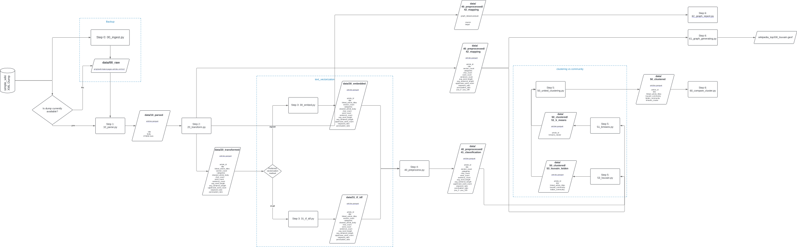

## Table of Contents
- [Table of Contents](#table-of-contents)
- [Wikipedia Graph Analysis Project](#wikipedia-graph-analysis-project)
  - [🔧 Setup Instructions](#-setup-instructions)
    - [1. Activate Virtual Environment (Windows PowerShell)](#1-activate-virtual-environment-windows-powershell)
    - [2. Install Dependencies](#2-install-dependencies)
  - [🗂️ Project Structure](#️-project-structure)
  - [🚀 Running the Pipeline](#-running-the-pipeline)
    - [Step 0: Ingest Data (Optional)](#step-0-ingest-data-optional)
    - [Step 1: Parse XML to Parquet](#step-1-parse-xml-to-parquet)
    - [Step 2: Transform and Clean Data](#step-2-transform-and-clean-data)
    - [Step 3: Generate Embeddings Vector](#step-3-generate-embeddings-vector)
    - [Step 4: Preprocess the Dataset](#step-4-preprocess-the-dataset)
    - [Step 5: Perform Clustering](#step-5-perform-clustering)
    - [Step 6: Cluster Comparison and Analysis](#step-6-cluster-comparison-and-analysis)
  - [Execution Summary](#execution-summary)
  - [Internal Pipeline](#internal-pipeline)
  - [Streamlit Dashboard execution](#streamlit-dashboard-execution)
  - [📚 Acknowledgements](#-acknowledgements)


## Wikipedia Graph Analysis Project

This project provides a pipeline for downloading, parsing, and cleaning Wikipedia dumps to extract article text and outgoing links. This data can then be used for various graph analysis tasks.

### 🔧 Setup Instructions

Follow these steps to set up your project environment.

#### 1. Activate Virtual Environment (Windows PowerShell)

**Note:** Depending on your installation, you might require to use `py` instead of `python` whenever trying to run a python command presented in this documentation

It's recommended to use a virtual environment to manage project dependencies:

``` powershell
python -m venv venv
Set-ExecutionPolicy Unrestricted -Scope Process
.\\venv\Scripts\Activate.ps1
 ```

#### 2. Install Dependencies

Install the necessary Python libraries using the provided requirements.txt file.

``` powershell
pip install -r requirements.txt
```

### 🗂️ Project Structure

The project is organized as follows:

```
project/
├── data/
│   ├── 00_raw/                       # (Optional) Compressed Wikipedia dump(s)
│   │   └── simplewiki-latest-pages-articles.xml.bz2
│   │   
│   ├── 10_parsed/                    # Stores title + raw Wikitext (Parquet format)
│   │   └── articles.parquet
│   │   
│   ├── 20_transformed/               # Stores clean_body + destination articles (Parquet format)
│   │   └── articles.parquet
│   │   
│   ├── 30_embedded/                  # Adds embeddings to articles (Parquet format)
│   │   └── articles.parquet
│   │    
│   ├── 31_tf_idf/                    # Stores TF-IDF features (Parquet format)
│   │   └── articles.parquet
│   │
│   ├── 40_preprocessed/              # Generates clustering and network analysis-ready dataset (Parquet format)
│   │   ├── 41_classification
│   │   │   └── articles.parquet      # Generates clustering dataset ready for K-Means
│   │   └── 42_mapping
│   │       ├── articles.parquet      # Generates base dataset for graph_analysis (Louvain)
│   │       └── graph_dataset.parquet # Edge map based on the articles.parquet file
│   │ 
│   └── 50_clustered/                 # Stores clustering results
│
├── src/
│   ├── 00_ingest.py                  # Script to download Wikipedia dumps
│   ├── 10_parse.py                   # Script to parse XML to Parquet
│   ├── 20_transform.py               # Script to clean markup and extract links
│   ├── 30_embed.py                   # Script to generate embeddings vector of articles
│   ├── 31_tf_idf.py                  # Script to generate TF-IDF features for articles
│   ├── 40_preprocess.py              # Script to clean a dataset with embeddings
│   ├── 50_united_clustering.py       # Script to unify both scripts below and their outputs for comparative analysis
│   ├── 51_kmeans.py                  # Applies KMeans clustering to preprocessed data
│   ├── 53_louvain.py                 # Applies Louvain community detection to mapping data
│   ├── 60_compare_clusters.py        # Script to compare the results of both Louvain community detection and K-Means
│   ├── 61_graph_generating.py        # Script to generate graph structures for analysis
│   ├── analysis/
│   │   └── category_analysis.py    # Analysis scripts for categories and more
│   └── utils/
│       ├── stream_bz2.py           # Utility for streaming bz2 compressed files
│       ├── textclean.py            # Utility functions for text cleaning
│       └── wikiclean.py            # Utility functions for cleaning Wikitext and columns
│
├── streamlit_app/
│   ├── home.py                     # Main page for running streamlit dashboard
│   ├── pages/              
│   │   └── 1_EDA.py                # First dashboard section. Works with dataset as-is; before cleaning
│   ├── data_sample/
│   │   └── articles_step_name_sample.parquet (*) # Dataset samples used to run the Streamlit Dashboard
│   └── sampler.py                  # Used to generate the sample files required for Streamlit Dashboard
│
├── reports/
│   ├── templates/                  # LaTeX templates (*.tex files, images)
│   ├── generated/                  # Output PDFs or *.tex files
│   └── generate_report.py          # Script that generates the LaTeX document
└── README.md                       # This file
```

### 🚀 Running the Pipeline

The data processing pipeline consists of four main stages. Each stage writes its output to the data/ directory and is idempotent, meaning if the target file already exists, rerunning the script will verify the timestamp and exit without reprocessing.

#### Step 0: Ingest Data (Optional)

Download the latest Simple English Wikipedia dump (approximately 200 MB). This step only needs to be run once, or you can skip it if you plan to parse from a URL directly in the next step.

``` python
python src/00_ingest.py
```

**Output:** Potentially stores downloaded dump in `data/00_raw/` 

#### Step 1: Parse XML to Parquet

Parse the downloaded XML dump (or directly from a URL) into a Parquet file containing article titles and raw Wikitext. This stage produces a file of approximately 230 MB with around 375000 pages.

``` python
python src/10_parse.py
```

**Output:** `data/10_parsed/articles.parquet`

#### Step 2: Transform and Clean Data

Parse and clean the Wikitext markup from the articles, extract network-related features, and prepare the data for downstream clustering and graph analysis.

We perform the following operations:

  - **Title normalization:** Convert article titles to lowercase for consistent matching.

  - **Link extraction:** Extract all internal article links from the Wikitext body using extract_links, and clean them using clean_linked_articles.

  - **Link filtering:** Filter the extracted links to retain only those that point to other valid article titles in the dataset.

  - **Section counting:** Count the number of section headers (== Section ==) as a proxy for article structure.

  - **Category extraction:** Extract MediaWiki categories from the Wikitext.

  - **Wikitext cleaning:** Clean the article body using parallel_clean_wiki_text to remove markup and non-textual content.

  - **Text feature extraction:** Extract several linguistic features from the cleaned text using extract_text_features:

    - **char_count:** Total number of characters (including spaces and punctuation).

    - **word_count:** Total number of words.

    - **sentence_count:** Number of sentences based on delimiters like ., !, ?.

    - **avg_word_length:** Average number of characters per word.

    - **avg_sentence_length:** Average number of words per sentence.

    - **uppercase_word_count:** Count of fully uppercase words.

    - **stopword_ratio:** Ratio of stopwords to total words (based on NLTK's English stopword list).

    - **punctuation_ratio:** Ratio of punctuation characters to total characters.

  - **Semantic cleaning:** Further clean the text for embedding generation using clean_for_embedding.

  - **Article ID assignment:** Assign a unique article_id to each article for downstream referencing.

  - **Network preparation:**

    - Generate a simplified dataset for graph-based analysis (article_id, title, linked_article_titles).

    - Construct a directed edge list (source, target) for graph building using valid article link relationships.

  - **Redirect filtering:** Remove pages that are redirects (detected via cleaned_article_body starting with "redirect"), this helps reduce cost f embedding vectors generation in next steps.

``` python
python src/20_transform.py
```

**Output:** `data/20_transformed/articles.parquet`
`data/20_transformed/articles.parquet`: Full dataset with cleaned text and features.

`data/40_preprocessed/42_mapping/articles.parquet`: Mapping of articles with links, used for graph analysis.

`data/40_preprocessed/42_mapping/graph_dataset.parquet`: Directed edge list (source-target) for graph clustering.

#### Step 3: Generate Embeddings Vector

Generate a set of columns from the embedding vectors for the Wikitext markup from the transformed data and export the result into a .parquet. 

In this stage, the text column `cleaned_article_body` is tokenized. After this, the embedding associated values are generated accordingly, resulting in the addition of 768 columns associated with the dimension of the embedding vector for each text.

The resulting DataFrame is exported into a .parquet file


``` python
python src/30_embed.py
```

**Output:** `data/30_embedded/articles.parquet`

> At this point, do note this dataset is considered ready for cleaning. This raw dataset weighs around 1.64 GB

#### Step 4: Preprocess the Dataset

In this stage, the text column `cleaned_article_body` is dropped, the column `article_id` is generated to keep consistency across the outputs; and two different datasets are generated:

**Mapping dataset**
In this dataset, we keep the columns: `article_id`, `title`, and `linked_article_titles`; since this will be used for network analysis; these are the only columns required at this point

**Clustering dataset**

In this dataset 105435 rows are redirects to other articles, which are not important for content-based clustering analysis, therefore, these will be dropped since they don't provide a significative insight for content-based clustering.

A set of columns from the embedding columns which represent the reduced dimensionality of the dataset through PCA, or SVD, whichever explains more variance on 200 components, and these columns will be included in the dataset whilst the embedding columns are dropped. 

``` python
python src/40_preprocess.py
```

**Output:** 
**One dataset for Mapping** 
`data/40_preprocessed_mapping/articles.parquet`

**One dataset for Clustering**
`data/40_preprocessed_classification/articles.parquet`

The resulting DataFrames are exported into a .parquet file

> At this point, do note these datasets are considered ready for clustering and network analysis. The raw datasets weigh around 42 MB and 377 MB

#### Step 5: Perform Clustering

This stage applies both content-based and network-based clustering algorithms to the processed Wikipedia articles. The results are used for downstream analysis and visualization.

**K-Means Clustering**  
The script `src/51_kmeans.py` applies K-Means clustering to the reduced feature set (PCA/SVD) of article embeddings. Each article is assigned a `kmeans_cluster` label.

```python
python src/51_kmeans.py
```

**Output:** `data/50_clustered/51_k_means/articles.parquet` 

**Louvain & Leiden Community Detection**  
The script `src/53_louvain.py` builds a graph from article links and applies both Louvain and Leiden community detection algorithms. Each article receives `louvain_community` and `leiden_community` labels.

```python
python src/53_louvain.py
```

**Output:** `data/50_clustered/53_louvain_leiden/articles.parquet`

**Unified Clustering Output**  
The script `src/50_united_clustering.py` merges the K-Means and Louvain/Leiden results into a single file for comparative analysis.

```python
python src/50_united_clustering.py
```

#### Step 6: Cluster Comparison and Analysis

This stage provides tools to compare and analyze the clustering results.

**Cluster Comparison**  
The script [`src/60_compare_clusters.py`](src/60_compare_clusters.py) compares the K-Means and Louvain/Leiden cluster assignments using several metrics:

- Adjusted Rand Index (ARI)
- Normalized Mutual Information (NMI)
- Homogeneity, Completeness, and V-Measure

```python
python src/60_compare_clusters.py
```

- **Input:** `data/50_clustered/articles.parquet`
- **Output:** Console report with comparison metrics and cluster statistics

**Graph Analysis and Reporting**  
Additional scripts are provided for graph sampling and reporting:

- `src/61_graph_generating.py`: Generates graph files (e.g., GEXF) for visualization tools like Gephi.
- `src/62_graph_report.py`: Produces statistics and samples from the article graph for reporting.


### Execution Summary

To run the entire pipeline:

``` python
# 1. Download the data (run once, or skip if parsing from URL)
python src/00_ingest.py

# 2. Parse XML to Parquet
python src/10_parse.py

# 3. Clean markup and extract outgoing links
python src/20_transform.py

# 4. Generate embbeding vector
python src/30_embed.py 

# 5. Generate clean dataset from clustering and network analysis
python src/40_preprocess.py

# 6. Apply clustering and community detection
python src/50_united_clustering.py

# 7. Perform graph analysis
python src/60_compare_clusters.py
python src/61_graph_generating.py
python src/62_graph_report.py
```

### Internal Pipeline
[](https://raw.githubusercontent.com/JhoaoAle/WikipediaGraphClassification/develop/pipeline.svg)

### Streamlit Dashboard execution

The `streamlit_app/` folder provides an interactive dashboard for exploring, analyzing, and visualizing the processed Wikipedia datasets and clustering results. This app is designed for both exploratory data analysis (EDA) and in-depth inspection of clustering and graph properties.

- **Pages Overview:**
  - [`home.py`](streamlit_app/home.py): Main entry point; displays project overview and README.
  - `pages/1_EDA.py`:  
    - Exploratory Data Analysis (EDA) of article features, categories, and missing values.
    - Visualizes text statistics, category distributions, and dimensionality reduction (PCA/SVD).
  - `pages/2_cluster_analysis.py`:  
    - Compares clustering results (KMeans, Louvain, Leiden) using metrics such as ARI, NMI, Homogeneity, Completeness, and V-Measure.
    - Visualizes cluster mapping with heatmaps and Sankey diagrams.
  - `pages/3_graph_analysis.py`:  
    - Interactive graph visualization using PyVis and NetworkX.
    - Explore communities, node centrality, and shortest paths in a GEXF-exported graph sample.
  - `pages/conclusions.py`:  
    - Summarizes key findings, network properties, and insights from clustering and community detection.

- **Sample Data:**  
  The `data_sample/` folder contains small Parquet and GEXF files for quick dashboard loading:
  - `articles_30_embedded_sample.parquet`
  - `articles_41_classification_sample.parquet`
  - `articles_50_clustered_sample.parquet`
  - `wikipedia_top200_louvain.gexf`

**Purpose:**  
The Streamlit app enables:
- Fast, visual exploration of the Wikipedia dataset at each pipeline stage.
- Interactive comparison of clustering and community detection results.
- Graph-based exploration of article relationships and communities.
- Communication of insights and conclusions in an accessible format.

Given you have the file generated by Step 3, you should be able to check first page of the Streamlit Dashboard, EDA.

After running the pipeline, you are ready to explore the frontend report, to do so you must run the following commands:

``` python
python streamlit_app/sampler.py
streamlit run streamlit_app/home.py
```


### 📚 Acknowledgements

This project uses the `wikitextparser` library to parse Wikitext into structured content.

Documentation up to date

